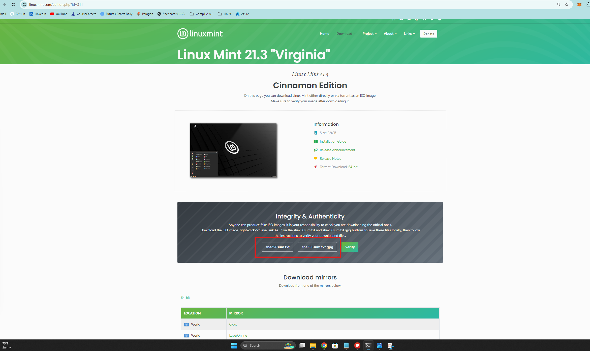

<h1>Deploying Linux Mint.</h1>
This tutorial outlines how to deploy Linux Mint or any other linux environment to a bootable media. 

<h2>Environments and Technologies Used</h2>

- Rufus
- Sha256 verification
- BIOS configuration

<h2>Installation Steps</h2>

First we begin at https://linuxmint.com/. 
  -Click "Download" 
  -Select which version you want. 
  -Click "Download again 

 

We will create a new folder for the next items to be saved in 
I named mine "ISO verify" 
  -Make sure all files are saved into the same folder 
Right click the two files sha256sum.txt and sha256sum.txt.gpg and "save link as" into your "ISO Verify" folder. 
  
Next we will go down to our download mirrors and pick a location closest to you.  
Download your ISO file and save into "ISO verify" folder. 
  
Navigate to https://www.gnupg.org/download/index.html and scroll down to GnuPG binary releases 
  -Select "Download" for windows 
  -Install GnuPG 
Right Click "ISO verify" folder and select "Open in Terminal" 
Run this command in your terminal making sure to replace the filename with the name of your .iso file you chose.     -- CertUtil -hashfile linuxmint-21.3-xfce-64bit.iso SHA256  
This will take a minute to load but you will receive an output of something similar to this b284afcc298cc6f5da6ab4d483318c453b2074485974b71b16fdfc7256527cb1 
Go into your "ISO verify" folder and open "sha256sum.txt and ensure that your "hash" (string of letters and numbers) matches one of the hashes listed in this folder. 
This verifies that the .iso file we downloaded is authentic and not a virus of some sort. 

 

Next we will download rufus.exe from https://rufus.ie/en/ 
Install rufus and run rufus.exe 
At this time make sure the hard drive or flash drive you want to download Linux to is plugged in and operational. 
The drive will be formatted and all data will be lost. 
Click "Select" under the Boot selection tab and select your .iso file 
All default settings should remain the same. 
Click start at the bottom 
You now have a bootable drive that has linux mint on it! 

 

Now we will boot into the BIOS to change our boot configuration. 
Your computer may have you press "Del" or one of the "F" keys while booting up in order to enter BIOS mode 
Otherwise you can hold "Shift" while pressing restart and navigate through the menus in order to get to "UEFI settings" 
A comprehensive guide can be found here https://www.tomshardware.com/reviews/bios-keys-to-access-your-firmware,5732.html 
Once we are in the BIOS we will want to change the settings so that our media we just created boots first 
A guide for that can be found here https://www.lifewire.com/change-the-boot-order-in-bios-2624528 
When the boot order is properly switched we should boot into our linux environment for the first time. 
There will be a desktop icon that allows you to install Linux permenantly on to your hard drive from there.
 

 
